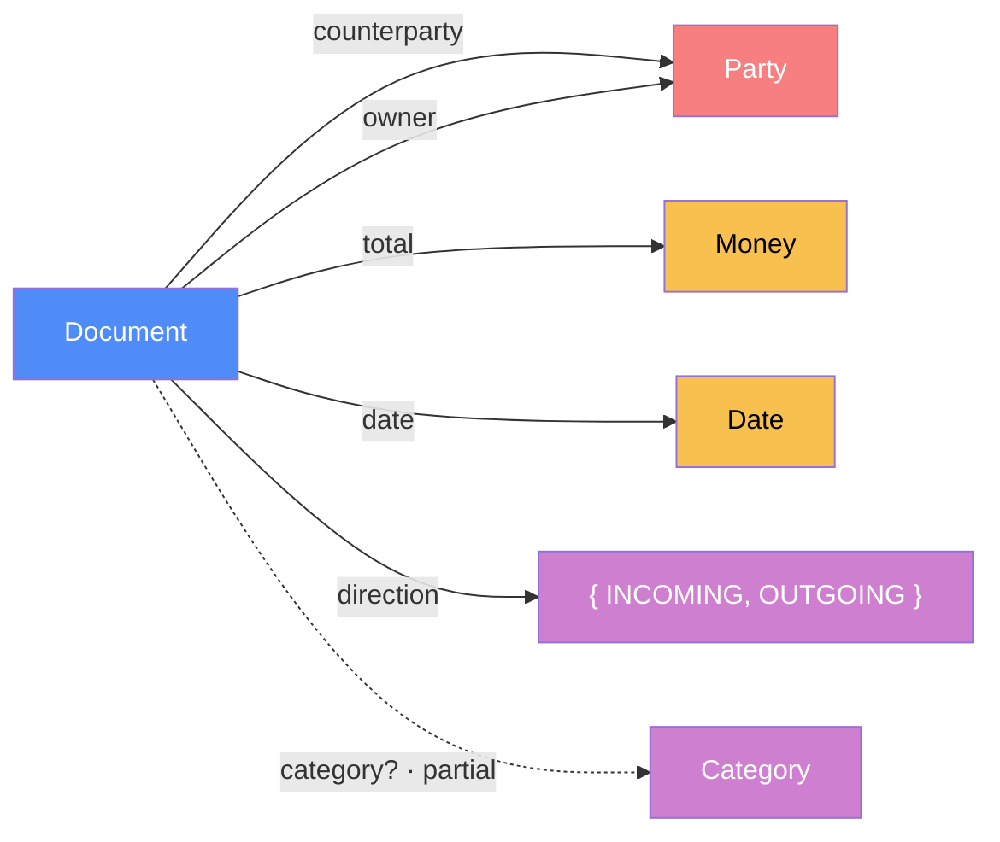
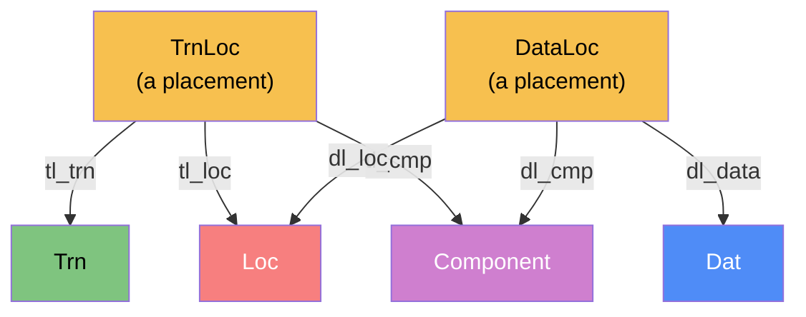
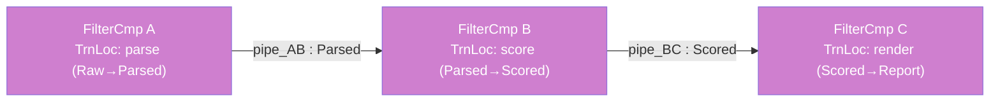
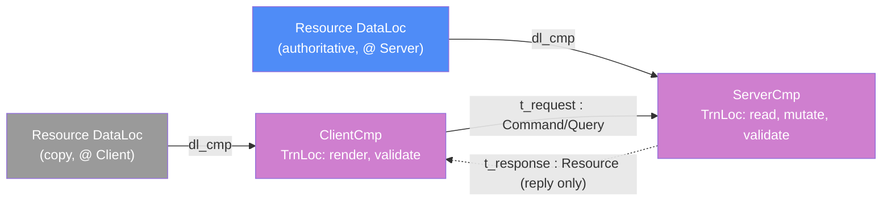
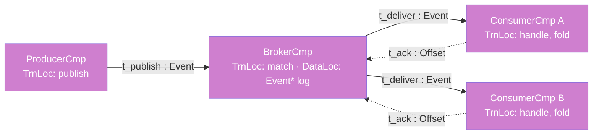
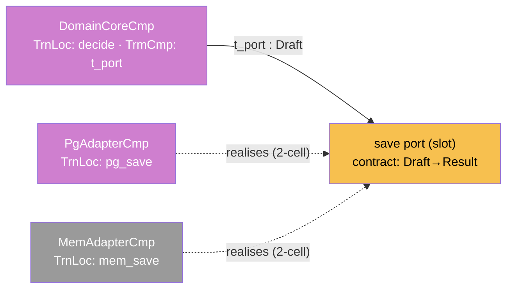

# FRAMEWORK.md

A portable framework for **designing, modeling, documenting, and building
software** — in any domain. It is product-agnostic by construction: the same
rules apply to a web service, a library, a compiler pass, an embedded driver, a
data pipeline, or a distributed system. Nothing here assumes a particular
language, framework, or layer of the stack.

The framework has one premise, one language, and three disciplines:

- **Premise** — a running system does exactly two things, and decomposes into
  exactly four atoms (§0).
- **Language** — category theory, used as a working tool rather than decoration:
  it turns "good architecture" from taste into something you can _check_ (§1).
- **Disciplines** — how you **model** (§2–§4), the **engineering principles**
  that fall out of the model (§5), and the **process** that keeps model and code
  in agreement (§6). Worked, cross-domain examples are in §7; a consolidated
  review checklist in §8; notation in the appendix.

> **How to read it.** §0–§1 are the foundation — read once. §2–§4 are the
> modeling core. §5–§6 are day-to-day rules. §7 proves the framework spans
> domains; reach for the instantiation closest to what you are building. §8 is
> the thing to run before merging.

---

## 0. Premise — what a system is

A running software system does two things, and nothing else. It **holds and
transforms data**, and it **transmits that data between physical sites**. Every
architecture decomposes into those, and into four atoms:

| Aspect          | Symbol | Side     | What it is                                                      |
| --------------- | ------ | -------- | --------------------------------------------------------------- |
| Data            | `Dat`  | Logical  | the data types the system holds, and the relations between them |
| Transformations | `Trn`  | Logical  | the algorithms that rewrite data                                |
| Locations       | `Loc`  | Physical | the execution sites — thread, core, cache, RAM, disk, NIC, node |
| Transmissions   | `Trm`  | Physical | the act of moving one datum between two sites                   |

`Dat` and `Trn` are the **logical** pair — what the software _means_; they have
no notion of _where_. `Loc` and `Trm` are the **physical** pair — what the
software _occupies_. Pure logic can compute forever and manifest nothing; the
physical pair is what makes it visible — without transmission to a boundary
there is no screen, no input, no interface at all.

Four atoms are not yet an architecture. An architecture is the **application of
the logical onto the physical**: _this_ transformation, placed on _that_ core;
_this_ datum, resident in _that_ RAM; _this_ transmission, on _that_ wire. That
application — bundled and composed — is the **Component** (§4). A component is
not a fifth atom; it is the construction that lifts the four atoms to where whole
services compose.

**Everything else in this document is discipline for keeping the model of those
four atoms honest.** When the model and the code disagree, one of them has a
bug.

---

## 1. The language — six definitions

The loose words people use for architecture — _relation_, _compose_, _deduced_,
_can be wrong_ — each have an exact counterpart in **category theory**. The
exact language is worth the page: it is what lets you _check_ a design instead of
arguing about it. Six terms; the rest of the document uses nothing else.

- **Category** — a set of _objects_ and _arrows_ (_morphisms_) between them.
  Arrows compose: if `f : A → B` and `g : B → C` then `g ∘ f : A → C` exists;
  composition is associative; every object has an identity arrow. That is the
  whole definition. Anything shaped like "things, and structure-preserving ways
  to get from one to another" is a category.
- **Morphism signature** — `f : A → B`. Always write source and target; the
  signature is half the content.
- **Partial morphism** — `f? : A → B`, defined on only some of `A`. This is how
  optionality is written: a nullable field, a value present in only one case.
- **Commuting diagram** — a diagram _commutes_ when any two paths with the same
  start and end are **equal as morphisms**: `g ∘ f = h`. Commuting is the
  property you _check_. A picture cannot fail to commute; a system can.
- **Functor** — a structure-preserving map between categories: objects to
  objects, arrows to arrows, preserving composition and identities.
- **Free monoid `A*`** — the finite sequences of `A` under concatenation: a log,
  a history, an append-only stream.

One more, used only for cross-cutting concerns: a **natural transformation** is a
uniform family of morphisms relating two parallel functors — one arrow per
object, every square commuting. "The same wrapper, applied everywhere."

---

## 2. Modeling data as a category — the olog

The first thing you model for any feature or module is its **data category**
`Dat`, written as an _olog_ (ontology log). Objects are data types; morphisms are
the stored or structural relations between them.

- **Objects** — entities (`User`, `Order`, `Packet`, `Node`) and primitive sets:
  `ℝ` (real/decimal), `𝕊` (string), `𝔹` (boolean), `ℕ` (natural), `Date`, `Json`.
- **Morphisms** — a field or foreign key is an arrow `Entity → Type`. A row is a
  **product** `×` (a bundle of fields). A tagged union is a **sum** `⊕`. A
  history or log is a **free monoid** `A*`.
- **Partiality** — a nullable/optional relation is a **partial morphism**,
  marked `?`.

### How to write a model section

Every feature- or module-level design document leads with its categorical model,
in this order:

1. **Why (one paragraph).** What does modeling this as a category buy _here_,
   concretely? (e.g. "nullability encodes optionality", "`from` decomposes as
   `by ∘ for`, so the column is redundant", "the fallback chain is a sequence of
   natural transformations".)
2. **The core category.** A diagram naming objects and labeled morphism arrows;
   dashed or `?`-suffixed arrows for partial morphisms.
3. **Morphism table.** Columns: `Morphism`, `Signature`, `Partiality`
   (Total / Partial / Deduced / Future), `Semantics`. **Every arrow in the
   diagram appears in the table**, and vice versa.
4. **Functors.** One diagram + table per functor to another category (a pipeline,
   a renderer, a strategy resolver, a status state machine).
5. **Composition rules.** Numbered equations and implications the implementation
   must preserve — invariants (`total = subtotal + tax`), deductions
   (`resolve = match ∘ vendor`), constraints (a uniqueness or naturality law).
6. **Bridges to other features.** A table of boundary morphisms, each with a
   `Stored?` column making the store-vs-deduce tradeoff explicit.
7. **Full diagram.** The subcategory in its surrounding scope, with all boundary
   morphisms (dashed for deduced/future).

A morphism table entry looks like this:

| Morphism  | Signature        | Partiality | Semantics                                |
| --------- | ---------------- | ---------- | ---------------------------------------- |
| `total`   | `Order → ℝ`      | Total      | the order's gross amount                 |
| `coupon?` | `Order → Coupon` | Partial    | applied discount, when one exists        |
| `tax`     | `Order → ℝ`      | Deduced    | `tax = rate ∘ jurisdiction` — not stored |

The model is the **authoritative specification for semantic relationships and
invariants** that span multiple fields, tables, or modules. It is _not_ a
replacement for the type system or the schema (those enforce types and DB-level
constraints) nor for the API surface. When code and model disagree, the model
describes the _intent_ and the code is corrected — or the model is updated with
explicit reasoning.

---

## 3. The Consolidation Principle

> **If object `X` can be described as "object `Y` plus additional morphisms",
> `X` is not a new object — it is `Y` with extra structure. Model it as an
> extension of `Y`, not as a parallel object.**

This is the single most valuable rule in the framework. The whole point of
modeling categorically is to **collapse** data, not to spawn parallel categories
joined by translator functors. The moment you find yourself designing a functor
`F : Cat₁ → Cat₂` that is **bijective on objects** — every object of one
corresponds to exactly one object of the other, differing only in which
morphisms are defined — you have _proven_ it is one category, not two. Do not
build `F`. Merge them; make the "extra" morphisms partial on the base object.

**Warning signs you are violating it:**

- A new top-level entry point, route, namespace, or module for what is
  conceptually a _filter over an existing entity_.
- A junction/link table whose only job is to mark which rows of an existing
  table belong to a subset.
- A translation layer (adapter, mapper, DTO) whose job is to convert between two
  shapes that differ only in which fields are populated.
- Documentation that must explain to users the difference between two things
  that are "almost the same" — a UX tax imposed by a modeling mistake.
- Two models with the same objects, different morphism sets, and a "bridge"
  between them that is really identity-on-objects.

**How to apply, in order:**

1. **Design.** Before adding an object, ask: _new object, or existing object
   with more morphisms?_ If the latter, add partial morphisms and a `kind?`
   discriminator, not a new type.
2. **Data.** A partial field on the base type (`base.extRef? : Base → Other`) is
   almost always right over a junction table that only marks membership.
   Junctions are for genuine many-to-many relations.
3. **Interface.** The base resource gains optional parameters (`?inSet=true`) and
   optional response fields — not a new endpoint or command prefix.
4. **UI / consumer.** The consolidated object gets a _badge_ or _filter_, plus an
   _extra section_ for the extra morphisms — not a dedicated screen.
5. **Review.** A change that adds a new namespace **and** a new junction table
   whose rows pair 1:1 with an existing subset is almost certainly violating
   this. Push back, draw the category, collapse it.

**Why it matters beyond elegance.** Every parallel object imposes real cost:
users learn two vocabularies for one concept; every feature touching the base
(search, filters, reports, permissions, exports) must be duplicated for the
twin; the translator is a bug farm where every drift is a defect; aggregations
must union two stores instead of filtering one. Consolidation pays for itself
immediately and compounds.

### The reduction — how a diagram deduces (a procedure)

This is the move the method exists for. It applies to **any two objects you
suspect are one**. The example domain is accounting — an `Invoice` (money we
issue) and an `Expense` (money we receive) — but the five steps never change.

**Step 1 — Write the naive model down, rigorously.** Two objects; list every
morphism out of each, _with its target_:

| `Invoice` morphism | target         | `Expense` morphism | target         |
| ------------------ | -------------- | ------------------ | -------------- |
| `issuer`           | `Organization` | `payer`            | `Organization` |
| `customer`         | `Organization` | `supplier`         | `Organization` |
| `total`            | `Money`        | `total`            | `Money`        |
| `lines`            | `LineItem*`    | `lines`            | `LineItem*`    |
| `issuedAt`         | `Date`         | `incurredAt`       | `Date`         |
|                    |                | `categorize`       | `Category`     |

The instant you write the _targets_, something the nouns hid surfaces: both
objects' morphisms land in the **same** objects. They share a centre.

**Step 2 — Map one category onto the other.** Propose `F : Expense → Invoice`.
On objects it is forced (`Expense ↦ Invoice`, shared objects to themselves). On
morphisms, pair by target: `supplier ↦ customer`, `payer ↦ issuer`,
`total ↦ total`, `lines ↦ lines`, `incurredAt ↦ issuedAt`.

**Step 3 — Check the squares commute.** A mapping means nothing unless it
_respects_ structure. For `total`, the square commutes iff the two `total`s
compute the same function — they do. Walk `Organization`: `supplier ↦ customer`
(both "the other party"), `payer ↦ issuer` (both "the owning party"). Every
shared-structure square commutes.

**Step 4 — Read the verdict.** Every square commuted and `F` is a bijection on
objects. _A functor bijective on objects that commutes everywhere is the identity
in disguise._ There was only ever one object. This is a proof, not a preference.

**Step 5 — What did _not_ commute is the other half of the answer.**
`categorize` had no partner; the _direction_ of the money is a genuine
difference. The morphisms that fail to commute are the **real** distinctions —
and the deduction hands them to you precisely. They are not erased; they are
**segregated** as partial morphisms on the unified object, selected by a
discriminator.

A reduction is two moves at once — **consolidate** every morphism whose square
commuted onto one object, **segregate** every morphism that did not as a partial
morphism. The output — one table, a `direction` column, `category` nullable, the
second table dropped — is read straight off the diagram.

### Corollary — deduce display data through the morphism; don't copy it

Once you add a partial morphism `m : A → B` pointing from the extended case of
`A` to the object that _already carries_ the data you'd otherwise copy, the
display morphisms on `A` must **resolve through `m`**, not duplicate onto `A`:

- Make the would-be-copied columns on `A` **nullable**.
- When `m(a) ≠ ∅`: the local columns MUST be null; each display morphism
  `f : A → T` is deduced as `f_B ∘ m` (read from `B`). Reject writes to them.
- When `m(a) = ∅`: the local columns are authoritative (the external case).

Copying re-introduces exactly the duplication consolidation removed: two sources
of truth that drift, exports that must pick one, sync jobs on every edit.
Deducing is the only way to honor "one concept, one place."

### Corollary — anchor a link on the durable entity, not the transient actor

When you link two entities through a relationship, the durable linkage lives
between the **entities themselves**, not through whatever actor or event happened
to create it. (A cross-organization supplier relationship is `Org → Org`, not
`Org → User`; a device pairing is `Device → Device`, not `Device → Session`.)
The actor that initiated the link is **audit metadata** (`createdBy`), not a
structural morphism. Read and authorization paths flow through the durable
entity; a pointer to the transient actor is a modeling error.

---

## 4. The architecture framework — atoms, placement, components

§2 modeled `Dat`. Now the other three atoms, and how the logical is _applied_
onto the physical.

### 4.1 The four atoms, precisely

**`Trn` — transformations.** A transformation is an algorithm. Here it is an
**object**, not an arrow — because the next step _places_ it, and you place
objects, not arrows. Each carries two projections into `Dat`:

| Morphism | Signature   | Semantics                   |
| -------- | ----------- | --------------------------- |
| `t_from` | `Trn → Dat` | the input type it consumes  |
| `t_to`   | `Trn → Dat` | the output type it produces |

`(t_from, t_to)` makes `Trn` a quiver over `Dat`; the **free category** on it is
the **algorithm category** `Alg`, whose morphisms are composable chains `f ; g`
with `t_to(f) = t_from(g)`. Effectful transformations are marked `⊸`.

**`Loc` — locations.** Objects are **physical execution sites** at whatever
granularity matters: a thread, a core, a register file, a cache line, a RAM
region, a disk, a NIC, a GPU streaming multiprocessor, an FPGA fabric block, a
process, a container, a cluster node, a serverless invocation. Morphisms are
_adjacency_ — "can hand off directly to." `Loc` is strictly physical: a tenant
partition, a security scope, an environment are **predicates on data**, not `Loc`
objects.

**`Trm` — transmissions.** A transmission moves one typed datum across a location
boundary. Like a transformation, it is an **object**, with three projections:

| Morphism  | Signature   | Semantics                                                |
| --------- | ----------- | -------------------------------------------------------- |
| `c_from`  | `Trm → Loc` | source location                                          |
| `c_to`    | `Trm → Loc` | target location                                          |
| `carries` | `Trm → Dat` | the datum on the wire — there is no untyped transmission |

The free category on `Trm` is the **routing category**: composable transmission
paths. A logical transmission usually _decomposes_ into hops (`core → NIC`,
`NIC → NIC`, `NIC → core`); that decomposition is composition in the routing
category. Model the logical transmission by default; refine to hops only where a
hop is where a property actually lives (a latency budget, an encryption
boundary).

### 4.2 Placement is a span, not a function

The four atoms are inert. A transformation is just a _meaning_; it is _nowhere_.
To run, it must be **placed** at a location. The naive formalization — a function
`runsAt : Trn → Loc`, "every transformation runs at exactly one location" — is
**false**:

- a validation runs in the client _and_ again on the server — one transformation,
  two locations;
- a render runs server-side, and again client-side under optimistic UI;
- a create exists as a function in application RAM _and_ as the statement
  executed inside the database.

So "where does `T` run" is a **relation**, not a function. The fix is to **reify
the pairing**: a placement is its own object — a span with projection morphisms.

| Placement | Projections                                          | Meaning                                                 |
| --------- | ---------------------------------------------------- | ------------------------------------------------------- |
| `TrnLoc`  | `tl_trn : →Trn` · `tl_loc : →Loc` · `tl_cmp : →Cmp`  | a transformation deployed at a location, in a component |
| `DataLoc` | `dl_data : →Dat` · `dl_loc : →Loc` · `dl_cmp : →Cmp` | a datum materialised at a location, in a component      |
| `TrmCmp`  | `ts_trm : →Trm` · `ts_cmp : →Cmp`                    | a transmission used by a component                      |

"Where does `T` run" is the **fibre** `{ tl_loc(tl) : tl_trn(tl) = T }` — the set
of placements projecting to `T`. It may be empty (an unused transformation), a
singleton, or larger. A transformation placed twice has two `TrnLoc` rows — and
the two may be _different code_ (a function in one place, a stored procedure in
another) realising the same `t_from → t_to` signature. That is the strategy shape
(§5). The same holds for data: one type materialised as a DB row, a heap object,
and bytes on a wire is three `DataLoc`s over one `Dat`; a transmission is the
bridge between two such `DataLoc`s.

### 4.3 Components compose

A **component** (`Cmp`) is a cohesive bundle of placements sharing one `Cmp`
value. A component **spans locations** — each placement carries its own `Loc`; a
component confined to one location is the special case, and one that straddles
the wire by design is what we call a **service**. What a component _owns_ is
**deduced** as the fibres of the projections, never stored twice:

| Deduced view   | Definition                                            | Semantics                         |
| -------------- | ----------------------------------------------------- | --------------------------------- |
| `data(c)`      | `{ dl : dl_cmp(dl) = c }`                             | its materialised data, with sites |
| `behaviour(c)` | `{ tl : tl_cmp(tl) = c }`                             | its placed transformations        |
| `channels(c)`  | `{ ts : ts_cmp(ts) = c }`                             | its transmissions                 |
| `locs(c)`      | image of `dl_loc`/`tl_loc` over the above             | the sites it occupies             |
| `depends-on`   | `c → c'` iff a `TrnLoc` of `c` consumes `c'`'s output | the dependency graph              |

Components **compose**, and composition is the payoff. A component exposes
**ports** — its boundary transmissions. Two components `A` and `B` glue along a
shared transmission: a port of `A` and a port of `B` naming the same `Trm`
(opposite orientation) are identified, and in the composite `C = A ⋈ B` that
transmission becomes **internal**. Gluing is associative and unital (the identity
is the empty pass-through), so components and their interfaces form a category
**`Comp`**: **objects are interfaces**, **morphisms are components**, composition
is port-matching. A composite service's data, behaviour, and locations are
_deduced_ from its parts — never re-described.

**Mapping to classical architecture (Fielding).** A configuration of
_components_, _connectors_, and _data_:

| Classical element | This framework                                         |
| ----------------- | ------------------------------------------------------ |
| datum             | `Dat`                                                  |
| connector         | `Trm`                                                  |
| component         | `Cmp`                                                  |
| configuration     | a composite `Cmp` — `Comp`                             |
| _(no equivalent)_ | `Loc` — the physical dimension classical accounts omit |

The omission of `Loc` is why prose architectures cannot tell you that a
transformation reads RAM nothing wrote, or that two "separate" components
silently share a thread. Adding `Loc` and stating everything as morphisms makes
those relationships _checkable_.

### 4.4 Natural transformations — the cross-cutting patterns

Three recurring patterns _are_ natural transformations (`α : F ⇒ G` between
parallel functors `F, G`):

- **Cross-cutting concern** (logging, auth, telemetry). With `Id : Comp → Comp`
  and `W` sending each component to "itself, and also log it," the concern is
  `log : Id ⇒ W`; naturality says wrapping commutes with the dependency graph —
  it applies uniformly and disturbs nothing.
- **Middleware / decorator.** `m : Id ⇒ Id`; `m_X : X → X` is the decoration;
  naturality `m_Y ∘ f = f ∘ m_X` is the law that it adds behaviour without
  changing what any call computes.
- **Strategy / provider swap.** Two `TrnLoc`s over the _same_ `Trn` are parallel
  realisations of one `t_from → t_to` contract — parallel arrows fitting one
  slot, the contract their shared boundary. A live implementation vs. a test
  double, interchangeable backends, pluggable algorithms — all this shape.

### 4.5 Coherence laws — where "wrong" lives

The architecture is **well-formed** iff these hold. They are the review checklist
(§8); a failed law _localises_ the defect.

1. **Placement honesty.** For every placement of transformation `T` at location
   `L`, each input `t_from(T)` is either _materialised_ at `L` (a `DataLoc` over
   that type at `L`) or _delivered_ to `L` (a `Trm` with `carries = t_from(T)`,
   `c_to = L`). _No transformation reads data not present at its location._
   Fail ⟹ a `DataLoc` or `Trm` is missing — a data teleport.
2. **Transmission well-typing.** `c_from`, `c_to`, `carries` are total, and
   `c_from(τ) ≠ c_to(τ)` — a transmission crosses a boundary; same-location data
   flow is a `Trn`, not a `Trm`. The carried datum is materialised at _both_ ends.
3. **Placement totality.** Every `TrnLoc` / `DataLoc` / `TrmCmp` has all
   projections defined. A transformation with no location, or a placement with no
   component, is not a placement.
4. **Dependency mediation.** For a `depends-on` edge `c → c'`, either their
   locations intersect at the point of contact, or a `TrmCmp` on the boundary
   carries the datum. _A cross-location dependency is mediated by a transmission,
   never a direct reach._ Fail ⟹ an unmediated cross-location call.
5. **Composition soundness.** When `C = A ⋈ B`: `data(C) = data(A) ⊎ data(B)`,
   `behaviour(C) = behaviour(A) ⊎ behaviour(B)`, `locs(C) = locs(A) ∪ locs(B)`,
   and each glued port becomes an internal `TrmCmp`. A composite's views are
   deduced from its parts, not redescribed.
6. **`runsAt` is a relation.** The map `Trn → 𝒫(Loc)` may be empty, a singleton,
   or larger. Any design assuming it single-valued — a `runsAt` column, a total
   `Trn → Loc` functor — is unsound. Encode placement as `TrnLoc` rows.

A design satisfying (1)–(6) has no teleported data, no untyped wire, no
straddling-but-undeclared module, and an honest multi-placement story.

---

## 5. Engineering principles that follow

These are not separate rules bolted on; each is a corollary of the model above.

- **Isolate effects behind a swappable boundary.** A component's outward
  transmissions should land on a **port** (a `Trm` typed only by its `carries`
  contract), never on a concrete external component. The concrete partner is
  glued in from outside. Then `behaviour(core)` is _invariant_ under which
  adapter is attached — testability and swappability become structural facts, not
  virtues (the hexagonal instantiation, §7.4). This is the strategy shape (§4.4)
  applied to boundary transmissions.

- **Strategies self-register; the core resolves one at runtime.** Pluggable
  variants — codecs, allocators, schedulers, backends, render targets,
  domain-specific rule sets — are parallel `TrnLoc`s over one contract. Adding a
  variant is **adjoining an object** to a 2-category and implementing the
  interface; it never edits the core. A registry maps a key to the chosen arrow.

- **Deduce, don't store.** A value computable from others is a **deduced
  morphism**; storing it (a cache, a memo, a denormalized column, a materialized
  view, mirrored state) is choosing to keep a _stored copy of a deduced morphism_
  for performance. That is sometimes right — but it is always a tradeoff with a
  cost: the copy can drift, and you now owe a consistency mechanism. Default to
  deducing; store only when forward navigation is a hot path that cannot be
  reconstructed cheaply, and say so in the composition rules. **Mirroring derived
  state and re-syncing it is the temporal version of the redundant-morphism
  smell.**

- **One source of truth for shared structure.** When two paths share structure,
  the structure lives in **one** place and the permitted variation is confined to
  a single declared _seam_ (a provider, a parameter, a strategy). Do not fork the
  shared structure to introduce a variant — push the difference to the seam. Two
  near-identical trees that drift are a defect waiting to happen.

- **Define each boundary once, declaratively.** An external boundary — an API, a
  CLI, an RPC surface, a public header, a wire protocol — should be declared from
  a **single source** from which the contract check, the documentation, and the
  client/tooling all _derive_. Hand-maintained parallel descriptions (a schema
  here, prose docs there, validation in a third place) drift; the drift is the
  bug. One declaration, many derived artifacts.

- **YAGNI; no premature abstraction.** Do not model morphisms for hypothetical
  futures. Do not add error handling, fallbacks, or validation for states that
  cannot occur — trust internal guarantees; validate only at system boundaries
  (the `Trm`s into your component). Three similar lines beat a premature
  abstraction. An abstraction earns its place when a _third_ call site appears,
  not before.

- **Act with care; weigh blast radius and reversibility.** Local, reversible
  changes (editing a file, running a test) are free. Hard-to-reverse or
  shared-state actions (deleting data, force-overwrites, publishing, migrating
  shared infrastructure) warrant confirmation first. When you hit an obstacle,
  find the root cause; do not bypass a safety check to make it go away.

---

## 6. Process & documentation discipline

The model is worthless if it drifts from the code. These rules keep them in
agreement.

1. **Design before implementing.** Before building a feature, write or update its
   design doc — _model first_. The first section after the overview is the
   **categorical model** (§2): objects and morphisms before tables and endpoints.
   This forces clear thinking about scope, data, interfaces, and edge cases
   before any code exists.
2. **Read before changing.** Before modifying an area, read its design doc to
   understand the intended structure. Keep implementation aligned with intent.
3. **Update after changing.** When code changes a documented relationship — a new
   field (a new morphism), changed behaviour, an added boundary — **update the
   model and morphism table in the same change.** A new field is a new morphism:
   write its signature, partiality, and semantics, and decide _stored vs deduced_,
   before writing the migration.
4. **Add missing docs.** Working in an undocumented area? Create the doc, leading
   with its categorical model. Add it to the index of models.
5. **Track progress against the spec.** Maintain a status document that maps every
   feature area to checkbox-level completeness, and update it whenever a change
   affects what is done vs. what remains.
6. **The model is a specification, not a transcript.** It states _intended_
   semantic relationships and invariants. When you find code violating a
   composition rule, either fix the code to restore the invariant or update the
   rule with an explicit "Note:" explaining the exception. Undocumented exceptions
   rot into bugs.

### Orchestration — tier the intelligence to the task

Process discipline extends to _who executes each step_. When work is delegated
across a fleet of agents (subagents, workflow stages, review panels), match the
model tier to the difficulty of the step — never put the whole fleet on one
tier. Cost scales with fan-out, and fan-out is dominated by the cheap steps;
quality is set by the few hard ones.

| Tier       | Use for                                                                                                                                                                                          |
| ---------- | ------------------------------------------------------------------------------------------------------------------------------------------------------------------------------------------------ |
| **Fable**  | HARD tasks only — complicated design, deep analysis/review, adjudicating conflicting findings, controlling/judging other models' output                                                          |
| **Opus**   | Intermediate tasks — coding, simple/guided designs, writing tests, performance work, root-cause investigation                                                                                    |
| **Sonnet** | Straightforward/repetitive coding with no novel reasoning — boilerplate routes/controllers (standard validation + queries), routine tests, adversarial verifiers, structured code-reading checks |
| **Haiku**  | Mechanical execution — running commands, greps/inventories, highly guided instructions and summaries                                                                                             |

Two corollaries: (1) verification fan-out (N verifiers per finding) rides the
cheap tiers — a panel's power comes from independence, not per-agent depth;
(2) the top tier belongs at the _control points_ — framing the question,
judging the answers — never inside the loop body.

A healthy lifecycle: **brainstorm → spec (with the model) → plan → implement →
review against the coherence laws → update docs.** The model is touched at the
first and last step, and consulted at every one in between.

---

## 7. Worked instantiations across domains

The same lens, applied to different shapes of system. Each style is _one
constraint_ flipped relative to a neighbour — which is exactly why the framework
can express all of them without special cases. Reach for the one nearest what you
are building.

### 7.1 Pipe-and-filter — pipelines, dataflow, algorithmics

Data enters one end, walks a straight line through independent stages, leaves
transformed. Each **filter** does one job and knows nothing of its neighbours;
the **pipes** carry typed data forward. A shell pipeline, a build, an ETL job, a
compiler's pass sequence — all this shape. Pipe-and-filter constrains the
**transformation layer**: the whole architecture is one composable chain in `Alg`.

`Trn` — each filter is one transformation (`parse : Raw → Parsed`,
`score : Parsed → Scored`, `render : Scored → Report ⊸`). `Loc` — one site per
filter, _not necessarily distinct_: a shell runs them in one process, a stream
job spreads them across machines. `Trm` — one pipe per adjacent pair, carrying
the upstream output type.

**The constraint, as a law.** The `depends-on` graph is a linear chain; each
component holds exactly one `TrnLoc` of one transformation `fᵢ`; and for every
edge, `t_to(fᵢ) = t_from(fᵢ₊₁)`. That single equation _is_ "pipe-and-filter" —
and it is Coherence Law 1 specialised: the only thing delivering `fᵢ₊₁`'s input
is the pipe, so the pipe must carry exactly that type. A filter whose input type
isn't the upstream output type is a pipe that cannot be welded — rejected before
anything runs.

**What it tells you.** Edges are `COMPOSE`, not `CALL` — one direction, no return
`Trm`. Splicing a filter is _adjoining one arrow_ (legal exactly when the types
match at both new seams); no other filter changes. Filters are trivially
relocatable — their only contract is `t_from → t_to`, so a shell pipeline and a
distributed stream job are _the same architecture at different placements_. The
honest cost: one input and one output type means nowhere to keep accumulated
state; cross-stage context must be threaded through the pipe or it breaks the
chain.

> A pure, in-process algorithm is the **degenerate** case: all filters share one
> `Loc`, every pipe is same-location, and the physical pair collapses — the
> framework reduces to just `Dat` + `Alg` (the pass pipeline). The model
> _degrades gracefully_: you only pay for `Loc`/`Trm` structure when distribution
> is real.

### 7.2 Client–server — networked request/response

Two parties at two places: the **client** asks, the **server** holds the
authoritative data and answers. Every exchange opens on the client side. The
style constrains **who may open a transmission** and **who owns the authoritative
copy**.

`Loc` — exactly two: `Client`, `Server` (with its store). `Trn` — `read`,
`mutate` server-side (the only writes); `render` client-side; `validate` placed
_both_ sides. `Trm` — request/response pairs. The `Resource` datum has two
`DataLoc`s over one `Dat`: authoritative at `Server`, a copy at `Client`.

**The constraint, as a law.** Initiation is **directed**: every `Trm` with
`c_from = Server` exists only as a reply _paired after_ a request to the server.
No server-side transmission is an opening move. This strengthens Law 4 —
mediation is one-directional; `depends-on` carries no `Server → Client` edge.

**What it tells you.** _"Never trust the client" is a Law 1 fact_: the client's
copy is a different placement from the authoritative one, so any `mutate` that
must produce authoritative data reads against the real store and can only be
placed at `Server`. _Validation that runs twice is honest_ — `validate` has two
`TrnLoc`s (snappy client UI, real server enforcement), parallel realisations of
one contract, not a redundancy to delete. The server bottleneck is structural:
every client's `depends-on` edge points at it, visible on the diagram before it
shows up in production. (Lift the initiation constraint and you have
**peer-to-peer**: the `Trm` relation goes symmetric, no single authoritative
`DataLoc`.)

### 7.3 Event-driven publish–subscribe — decoupling, distributed integration

A publisher never calls a consumer. It emits an **event** to a broker; whoever
**subscribed** to that type receives it. The publisher does not know who — or
whether anyone — listens. This is _implicit invocation_.

`Trn` — `publish : DomainChange → Event ⊸`, `match : Event → Subscription*`
(the broker's routing), `handle : State × Event → State`,
`fold : Event* → State` (consumer projection). `Loc` — `Producer`, `Broker`
(with its durable `BrokerLog`), `Consumer` (usually several). The `Event` has
_three_ `DataLoc`s: in producer RAM, persisted at the log, received at a
consumer.

**The constraint, as a law.** Delete the direct edge: there is no transmission
`Producer → Consumer`. The dependency _factors_ — `t_deliver ∘ t_publish` passes
_through_ `Broker`. In the `depends-on` graph there is no edge
`Consumer → Producer`; both point at `Broker`. "A doesn't know B exists" is not
discipline — it is the _absence of a `Cmp`-reference_, a fact about the diagram.

**What it tells you.** _Extensibility is adjoining an object_: a new subscriber
is a new component, its `handle`/`fold`, a subscription, and one new
`t_deliver` — no existing placement changes, and the publisher cannot observe the
addition. _Temporal decoupling is the persisted `Event_` `DataLoc`*: published
now, delivered later; producer and consumer need never be co-live.*Fan-out is
`match`\*, one functor turning one event into many deliveries. The honest cost:
control flow — which consumer runs after a publish — lives in subscription data,
in no component's placements.

### 7.4 Hexagonal (ports & adapters) — boundary discipline made structural

A domain core that touches the outside world only through abstract **slots**. The
core never names a database driver or an HTTP client; it declares a **port**, and
an **adapter** is plugged in from outside to fulfil it. This is the
canonical realisation of "isolate effects behind a swappable boundary" (§5).

`Trn` — `decide : Command → Draft` (pure core rule); `save : Draft → Result ⊸`
is the **port contract**; `pg_save` and `mem_save` are _parallel_ realisations of
it — same signature, different code. `Loc` — `Core`, and each adapter's concrete
site (`Postgres`, `Heap`, a test double). **The port has no `Loc`** — it is an
interface, not a place.

**The constraint, as a law.** No boundary `TrmCmp` of the core has an endpoint
inside a _concrete_ external component; every one lands on a **port** typed only
by its `carries` datum, and which component sits on the other end is decided by
gluing, later, from outside. This _relaxes_ Law 4 in one precise way — the
mediating `Trm` is identified by contract, not by partner.

**What it tells you.** It _is_ the strategy 2-category applied to a component's
boundary transmissions: each adapter is a parallel arrow over one contract;
choosing one is selecting a 2-cell. _Testability is structural_:
`Core ⋈ TestDouble` is a valid composite with **zero change to the core's
placements** — `behaviour(Core)` is invariant under which adapter is glued in.
_Extensibility is adjoining a component._ The honest cost: every port needs at
least one adapter, and each adapter is a real component to maintain — for a system
with one backend forever, the indirection earns nothing.

### 7.5 The neighbours — one flipped constraint each

The remaining common styles are each _one constraint_ away from the above, which
is the point: the framework expresses a whole family by varying a single rule.

- **Layered / n-tier.** A `rank : Comp → (ℕ, <)` with
  `depends-on(c, c') ⟹ rank(c') = rank(c) + 1` — every dependency lands one rank
  down, never up, never skipping. _Layered_ constrains `Comp` only; _n-tier_ adds
  a separate placement constraint (`tl_loc` injective across layers). A monolith
  is layered but not n-tier. Cross-cutting concerns can't be `depends-on` edges
  (they'd skip ranks) — so they _must_ be natural transformations, which is why
  every layered system grows a middleware/aspect escape hatch.
- **Pipe-and-filter vs layered.** Same linear shape, different edge: layered edges
  are _calls_ (a round trip, down and back); pipe edges are _compositions_ (one
  way, no return).
- **Microservices.** Make data placement **exclusive**:
  `dl_data(dl) = dl_data(dl') ⟹ dl_cmp(dl) = dl_cmp(dl')`. No type is
  materialised in two components; each service owns its store. The shared
  `DataLoc` is gone, so a cross-service need _must_ become a transmission — Law 4
  stops being advice and becomes the only way two services interact. The
  distributed-transaction / eventual-consistency tax is the direct, predicted
  consequence.
- **SOA vs microservices.** Same private-data services; SOA routes every
  inter-service transmission through one shared bus component, microservices keep
  them point-to-point ("smart endpoints, dumb pipes").

### 7.6 Low-level / systems — the physical aspect made literal

The style gallery is software-architecture-level; the same atoms reach all the
way down. Consider a DMA-driven device path or a memory allocator.

`Dat` — byte buffers, descriptor structs, a free list. `Trn` — `build_descriptor`,
`checksum`, `allocate`/`free`. `Loc` — a CPU core, an L1/L2 cache line, a specific
RAM region, an MMIO register block, a DMA engine, a peripheral's internal buffer;
adjacency is _bus connectivity_. `Trm` — a DMA transfer (RAM ↔ peripheral, carrying
a buffer), an MMIO write (core → register, carrying a control word), a cache-line
fill (RAM → L1).

Here **Coherence Law 1 becomes a literal hardware-bug detector.** A transformation
that reads a buffer must have that buffer _present_ at a location it can address.
A consumer that reads a DMA target _before_ the transfer completes is reading a
location no `Trm` has yet delivered to — Law 1 fails, and the framework names the
missing transmission. The "no data teleport" rule is, at this level, exactly the
read-before-DMA-completion race. Consolidation applies too: a "request descriptor"
and a "response descriptor" that share a header and differ only in which fields
are populated are **one** tagged struct with partial fields, not two parallel
types.

---

## 8. Review checklist

Run this before merging any non-trivial change.

**Coherence (the architecture is well-formed iff):**

- [ ] **Placement honesty** — every transformation's inputs are materialised or
      delivered at its location. No data teleport.
- [ ] **Transmission well-typing** — every `Trm` is typed (`carries`) and crosses
      a real boundary (`c_from ≠ c_to`); the datum is materialised at both ends.
- [ ] **Placement totality** — every placement has all projections defined.
- [ ] **Dependency mediation** — every cross-location dependency goes through a
      transmission, never a direct reach.
- [ ] **Composition soundness** — composite views are deduced from parts, not
      redescribed; glued ports are internal.
- [ ] **`runsAt` is a relation** — no design assumes one transformation has one
      location.

**Modeling smells:**

- [ ] No new object that is an existing object "plus morphisms" (§3). No junction
      table that only marks a subset. No translator between shapes that differ
      only by which fields are populated.
- [ ] Display data on an extended object is **deduced through** the consolidation
      morphism, not copied.
- [ ] Stored values that are really deduced (caches, denormalized columns,
      mirrored state) are justified and have a consistency mechanism.
- [ ] Every morphism in a diagram is in the morphism table, and vice versa; new
      fields updated the table in this same change.

**Process gates:**

- [ ] The design doc / categorical model was updated _with_ the code, not after.
- [ ] Boundaries are declared from a single source; docs and validation derive
      from it.
- [ ] Status tracking reflects the new completeness.
- [ ] Any violated composition rule is either fixed or documented as an explicit
      exception.

---

## Appendix — notation & conventions

**Objects.** `PascalCase` entity names (`Order`, `Packet`, `Node`); Unicode set
symbols for primitives — `ℝ` (decimal/float), `𝕊` (string), `𝔹` (boolean), `ℕ`
(natural), `Date`, `Json`, `Currency`.

**Morphisms.** Short `snake_case` / `camelCase` (`price`, `qty`, `t_from`,
`carries`). Prefix with the source initial to disambiguate (`li_qty` vs
`oi_qty`). Always write the signature `f : A → B`.

**Partiality markers.** Append `?` to a partial (nullable) morphism in diagrams;
in tables use `Total`, `Partial`, `Deduced`, or `Future`. Deduced morphisms use
dashed edges `-.->|"label (deduced)"|`.

**Spans & junctions.** For many-to-many, prefer `A ← Junction → B` (two total
morphisms out of the junction) over storing both ends; document the span.

**Enums as discrete categories.** A status or kind enum is a discrete category (no
non-identity arrows between elements). A status _state machine_ is a functor from
the feature category into a poset.

**Self-registration as a 2-category.** Pluggable strategies (handlers, templates,
codecs, adapters) form a 2-category: each strategy is an object, the shared
interface methods are parallel 1-morphisms, and the resolver picks one concrete
morphism at runtime.

**Mermaid color legend** (consistent across all diagrams):

| Color  | Hex       | Used for                                         |
| ------ | --------- | ------------------------------------------------ |
| Blue   | `#4f8cf7` | main data entities / authoritative `DataLoc`     |
| Green  | `#7fc47f` | transformations (`Trn`)                          |
| Red    | `#f77f7f` | locations (`Loc`) / tenant or owning party       |
| Teal   | `#7fc4c4` | transmissions (`Trm`) / junction objects         |
| Yellow | `#f7c04f` | primitives & scalars / placement objects / ports |
| Purple | `#cf7fcf` | components (`Cmp`) / enums                       |
| Grey   | `#9a9a9a` | deduced / future / non-authoritative copies      |
