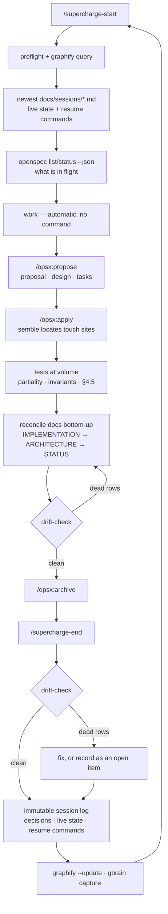
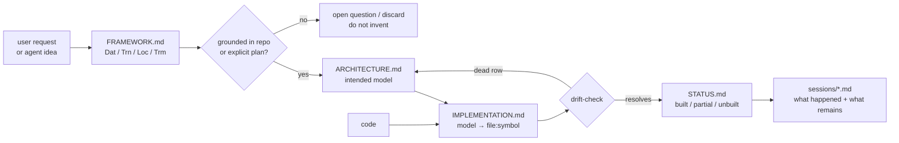

# supercharge

Five slots, one loop, one install.

`supercharge` does **not** replace [semble](https://pypi.org/project/semble/),
[graphify](https://pypi.org/project/graphifyy/) or
[OpenSpec](https://github.com/Fission-AI/OpenSpec) — it routes them, and adds the
one layer none of them have. Those three describe **what exists**, and a description
derived from the code can never contradict the code. Drift is only detectable when
something independent asserts *intent*. `supercharge` owns that assertion — the
architecture model, the session handoff, and a script that proves the model→code map
still resolves. Start a session, work against the shared model, end with a handoff
another agent can resume from without chat history.

---

## Install

```bash
git clone https://github.com/LessComplexity/supercharge.git
cd supercharge
./install.sh
```

That installs everything: the skill into every agent you already have, and the four
tools it uses. Running it again is safe.

Then once per project:

```bash
openspec init     # sets up change tracking for this project
graphify .        # builds the code graph
```

Open `openspec/config.yaml` and paste in the block from
[references/openspec.md](skills/supercharge/references/openspec.md#3-keeping-openspec-artifacts-categorical).
It teaches OpenSpec your architecture rules.

Start working:

```
/supercharge-start
```

That's it. If something did not install, or you want to know exactly what went where,
see [Install details](#install-details).

## The five slots

The most useful frame in the whole design. Every tool answers a different question;
the failure mode is letting two of them answer the same one.

| Slot | Tool | Answers | Scope | State it keeps | Machine-checkable |
| --- | --- | --- | --- | --- | --- |
| Retrieval — pinpoint | **semble** | where is symbol X | current code | index (disposable) | n/a |
| Retrieval — structural | **graphify** | how does X connect to Y | repo corpus graph | `graphify-out/` (rebuildable) | n/a |
| Memory — cross-project | **gbrain** | what did we decide, anywhere | all projects, non-code sources | brain git repo + PGLite | partial |
| Work state | **OpenSpec** | what is in flight, what is next, is it done | one repo, per change | `openspec/` | **yes** |
| Intent | **supercharge** | what the system is *supposed* to be | one repo, durable | `docs/` | via drift-check |

## The three modes



| Mode | Reads | Writes | Delegates to |
| --- | --- | --- | --- |
| **`start`** | preflight · `graphify query` · newest `docs/sessions/*.md` · `openspec list/status --json` · `docs/STATUS.md` | nothing | graphify, OpenSpec |
| **`work`** | the change's tasks · `ARCHITECTURE.md` · semble lookups | code · tests · `docs/**` reconciled · `reviews/review-<slug>.md` | OpenSpec propose/apply/archive, semble, graphify |
| **`end`** | drift-check · git/live state · `openspec list/status --json` | `docs/sessions/YYYY-MM-DD-<slug>.md` · reconciled docs | graphify `--update`, gbrain `capture` |

**Two commands, three modes.** `start` and `end` are rituals with no natural trigger
in a prompt, so they get commands. `work` does not: the request to add, change or fix
code *is* the trigger, and `start` has already loaded the flow into context. A
`/supercharge-work` command would only re-inject text that is already there — and
would imply the discipline is opt-in, which is the failure this skill exists to
prevent.

## Ownership law

One writer per artifact. Breaking this is how four stores rot into four stale stores.

```
intent       → docs/<component>/ARCHITECTURE.md    supercharge — hand-authored, normative, small
mapping      → docs/<component>/IMPLEMENTATION.md  supercharge rows, machine-verified by drift-check
in-flight    → openspec/changes/<slug>/            OpenSpec — machine-checkable
behaviour    → openspec/specs/<domain>/spec.md     OpenSpec — observable contract only
continuity   → docs/sessions/<date>-<slug>.md      supercharge — live state + resume commands
structure    → graphify-out/                       graphify — derived, never hand-edited
memory       → the gbrain brain repo                 gbrain — an INDEX over docs/sessions/, never the original
```

Corollaries: nothing in `openspec/changes/` survives past archive; `graphify-out/` is
derived and git-ignored; `docs/` is never generated wholesale.

## What it creates in your repo

| Path | Written by | Hand-authored or derived |
| --- | --- | --- |
| `docs/architecture-map.md` | you / the agent | hand-authored |
| `docs/<component>/ARCHITECTURE.md` | you / the agent | hand-authored — the normative claim |
| `docs/<component>/IMPLEMENTATION.md` | you / the agent | hand-authored rows, machine-**verified** |
| `docs/<component>/STATUS.md`, `docs/STATUS.md` | `end` | derived from the rows above |
| `docs/<component>/reviews/review-<slug>.md` | `work` | the §4.5 checklist run |
| `docs/sessions/YYYY-MM-DD-<slug>.md` | `end` | hand-authored, **immutable** |
| `openspec/` | OpenSpec | machine state — `changes/` is deleted at archive |
| `graphify-out/` | graphify | derived — **git-ignore it** |

There is no `plans/` folder: in-flight work lives in `openspec/changes/<slug>/`.

## The formal basis

[`FRAMEWORK.md`](skills/supercharge/FRAMEWORK.md) models the system as data (`Dat`),
transformations (`Trn`), locations (`Loc`) and transmissions (`Trm`), with §4.5
coherence laws you *check* rather than argue about.

Every claim must be grounded in an object, morphism, location or transmission, and
map to a real `file:symbol`, a planned item, or an explicit open question. The point
is to stop agents inventing architecture, not to produce prettier documents. An
agent that must answer "what object is this?", "what morphism changes it?", "where
does it run?", "what carries it across a boundary?" and "which real code realises
it?" cannot quietly hallucinate a subsystem.



Read `FRAMEWORK.md` rather than this summary — it is the spine, and every generated
doc cites the section it applies.

## drift-check

The one piece of genuinely new machinery. `IMPLEMENTATION.md` claims the model maps
to code; nothing verified it. This does.

It extracts every backticked `path:symbol` from `docs/*/IMPLEMENTATION.md`, resolves
the path against `git ls-files` by **path suffix** (so docs may use repo-relative or
service-relative paths), then confirms the symbol still appears in that file. A dead
row is drift.

```bash
supercharge-drift              # human-readable
supercharge-drift . --json     # {"dead":N,"total":N,"rows":[...]}
supercharge-drift --selftest   # builds a fixture, asserts both exit codes
```

**Exit code 0 when everything resolves, non-zero otherwise** — so it drops straight
into CI:

```yaml
- run: ./skills/supercharge/scripts/drift-check.sh .
```

**Measured, first run, on a real repo** (129 docs, 6 components): **59 dead / 345
refs — 32 dead paths, 27 dead symbols**, concentrated in one component (48 of them)
whose source directory had been renamed without the docs following. Real signal, from
~30 lines of shell.

Given a ~17% dead-row baseline on a repo that has never run it, **run it advisory for
the first month** and only then gate merges.

**Known ceiling.** Symbols are matched by substring grep, so a renamed symbol that
survives as a substring elsewhere in the file still passes, and refs written as a bare
filename (`order.py:Order.total`, no directory) are skipped to avoid matching prose.
The upgrade path is resolution through `semble search` or an LSP — not a stricter
regex. Do not pre-build it.

## Degradation matrix

Every tool is optional. Nothing here breaks a session.

| Missing | `start` | `work` | `end` |
| --- | --- | --- | --- |
| graphify | orient from `docs/` + sessions only | unaffected | skip the graph refresh |
| OpenSpec | no in-flight list | write the change folder by hand | no change snapshot |
| semble | slower location lookups | grep fallback | unaffected |
| gbrain | unaffected | unaffected | session log written, just not indexed across repos |

`preflight` reports what is absent, with the one install line that fixes it, and
**never exits non-zero**.

## Install details

Everything here is reference — the [Install](#install) section is all you need to get
running.

### What `./install.sh` does

1. Installs the four tools it delegates to: **OpenSpec** (via npm), **semble** and
   **graphify** (via uv), **gbrain** (via Bun, which it installs first if absent).
   Tools already present are reported, not reinstalled or upgraded.
2. Copies the skill into every agent system it detects.
3. Writes a marker-delimited section into the `AGENTS.md` files, for agents that read
   those instead of loading a skill folder.
4. Puts `supercharge-drift` and `supercharge-preflight` in `~/.local/bin`.
5. Prints a dependency report.

It never uses `sudo`, and it degrades rather than aborting — a tool that fails to
install prints its own install line and the rest continues.

```bash
./install.sh --project   # install the skill into this repo only
./install.sh --no-deps   # skill only, skip the tool installs
```

### Agent systems

Anything that loads a skill by copying a folder:

| System | Skills directory | `--project` scope |
| --- | --- | --- |
| Claude Code | `~/.claude/skills` | `./.claude/skills` |
| Codex | `~/.codex/skills` | `./.codex/skills` |
| opencode | `~/.config/opencode/skills` | `./.opencode/skills` |
| Kimi Code CLI | `$KIMI_CODE_HOME/skills` (default `~/.kimi-code/skills`) | `./.kimi-code/skills` |
| Shared / cross-tool | `~/.agents/skills` | `./.agents/skills` |
| GitHub Copilot CLI | `~/.copilot/skills` | user-level only |
| Pi | `~/.pi/agent/skills` | user-level only |
| Hermes | `~/.hermes/skills` | user-level only |
| Devin | `~/.config/devin/skills` | user-level only |
| Kimi Work (desktop) | `~/Library/.../daimon/skills` | user-level only |

Only directories that already exist are written to — the installer never creates an
agent system you do not have. Override the two non-standard roots with
`KIMI_CODE_HOME=` / `KIMI_WORK_HOME=`.

**Agents that read `AGENTS.md` instead** — Aider, OpenClaw, Factory Droid, Trae and
Codex — get a section written into `~/.codex/AGENTS.md` and `~/.agents/AGENTS.md`
(plus `./AGENTS.md` with `--project`, the file project-scoped agents actually read).
The block is bounded by `<!-- supercharge:begin -->` / `<!-- supercharge:end -->`, so
re-running replaces it in place instead of appending a second copy, surrounding
content is never touched, and deleting the block by hand is a clean uninstall.

**Not covered:** Cursor, Gemini CLI, Amp, Antigravity, CodeBuddy and Kiro. Each wires
tools through its own mechanism — `.cursor/rules/*.mdc`, a `GEMINI.md` section, a
steering file — so each is a separate integration rather than a folder copy or a
shared markdown section. Point them at the skill by hand:
`~/.claude/skills/supercharge/SKILL.md` is self-contained.

### Claude Code as a plugin

Instead of a bare skill — this also wires the semble MCP server from `.mcp.json`:

```
/plugin marketplace add LessComplexity/supercharge
/plugin install supercharge@supercharge
```

### gbrain setup

`install.sh` installs the gbrain binary; a brain is separate. `gbrain init` creates a
local PGLite brain at `~/.gbrain` and needs no API key for storage, but semantic
search needs an embedding model — it will pick one up from an existing
`OPENROUTER_API_KEY`, `OPENAI_API_KEY` or `VOYAGE_API_KEY`. Check with `gbrain doctor`.
Wire its MCP server and skills with `/plugin marketplace add garrytan/gbrain` +
`/plugin install gbrain@gbrain`.

`preflight` distinguishes an installed gbrain from a usable one, and the `end` step
skips its capture when no brain is configured.

> **Never `npm install -g gbrain`.** The npm package of that name is an unrelated
> GPU/ML library. The only supported sources are `github:garrytan/gbrain` and a git
> clone — which is what `install.sh` uses.

### Versions and telemetry

**Prerequisites:** Node ≥ 20.19 for OpenSpec, Bun ≥ 1.3.10 for gbrain — installed for
you if absent.

semble is pinned to `0.5.5`. OpenSpec deliberately floats `@latest`, because
`openspec update` regenerates a project's slash commands from the installed version
and a stale pin drifts against the docs it writes.

`install.sh` opts out of OpenSpec's telemetry, which is on by default upstream.
Re-enable with `openspec config set telemetry.enabled true`.

### If a tool is missing

Run `supercharge-preflight`. It prints what is present, what is missing with the one
line that fixes it, and never exits non-zero. Nothing here is mandatory — see the
[degradation matrix](#degradation-matrix).

## Risks, honestly

1. **Trigger roulette.** `/supercharge`, `/graphify` and `/opsx:*` sit in the same
   skill list, and overlapping descriptions make routing *worse*, not better — the
   classic failure of putting a router on top of tools that already work. Mitigated
   by scoping this skill's description to the session loop and architecture
   discipline only: it never claims "questions about the codebase" (graphify's
   trigger) or "propose a change" (OpenSpec's).
2. **Version drift in delegation.** Every delegated command name lives in exactly
   one file, [`references/openspec.md`](skills/supercharge/references/openspec.md),
   never scattered through `SKILL.md`. Nothing we do not own is pinned; `preflight`
   surfaces version mismatch early.
3. **Four memory stores.** `docs/`, `openspec/`, `graphify-out/` and the gbrain
   brain. Left unpoliced they duplicate each other within a month. Mitigated by the
   ownership law above, enforced as a hard rule in `SKILL.md`: one writer per
   artifact, `openspec/changes/` does not survive archive, `graphify-out/` is derived
   and git-ignored, `docs/` is never generated wholesale.
4. **`specs/` vs `ARCHITECTURE.md` duplication.** Both plausibly answer "what does
   this do". Decide A (skip specs) or B (specs = external surface only, the default)
   per repo and record it in `openspec/config.yaml` —
   [`references/openspec.md` §4](skills/supercharge/references/openspec.md).
5. **Upstream churn.** OpenSpec moves fast. Mitigated by a thin router and zero
   vendoring: graphify's skill, OpenSpec's skills and slash commands, and semble's
   server are all installed and updated upstream, never forked here.
6. **Loose symbol matching in drift-check** — documented ceiling, above.
7. **The loop is packaged but unproven.** `drift-check` is self-tested and the
   OpenSpec surface is verified against a live install, but no real change has yet
   gone end to end through propose → apply → reconcile → archive. The two claims that
   no self-test can reach are still untested: that `openspec status --json` actually
   lowers the cost of "where were we", and that the `rules:` block genuinely keeps
   OpenSpec artifacts categorical rather than just adding prose to a prompt.
8. **Two narrative stores.** gbrain and `docs/sessions/` both hold prose about what
   happened, and the second one always goes stale — unless only one of them writes.
   So only one does: **supercharge authors the session log, gbrain indexes it**
   (`gbrain capture --file docs/sessions/<newest>.md`, the last step of `end`). The
   file in git stays the source of record — reviewable in PRs and diffable. Never
   write a session narrative straight into gbrain. What gbrain adds that this loop
   cannot: `think`, whose gap analysis states what the brain does *not* know.

## Layout

```
supercharge/
├── .claude-plugin/{plugin,marketplace}.json
├── .mcp.json                    # semble MCP server
├── install.sh                   # skill + all four dependencies
├── commands/supercharge-{start,end}.md   # work has no command — it is the default
└── skills/supercharge/          # self-contained — this is what gets copied
    ├── SKILL.md                 # the router: start | work | end
    ├── FRAMEWORK.md             # the method — vendored, ours, unchanged
    ├── references/
    │   ├── docs-tree.md         # the docs/ contract + every template + scaffolding
    │   ├── reconcile.md         # implement → test at volume → reconcile → review
    │   ├── sessions.md          # start protocol, handoff log, end procedure
    │   └── openspec.md          # the delegation map — the ONLY place command names live
    └── scripts/
        ├── preflight.sh         # what is installed; never exits non-zero
        └── drift-check.sh       # IMPLEMENTATION.md rows → resolve file:symbol → dead rows
```

MIT.
