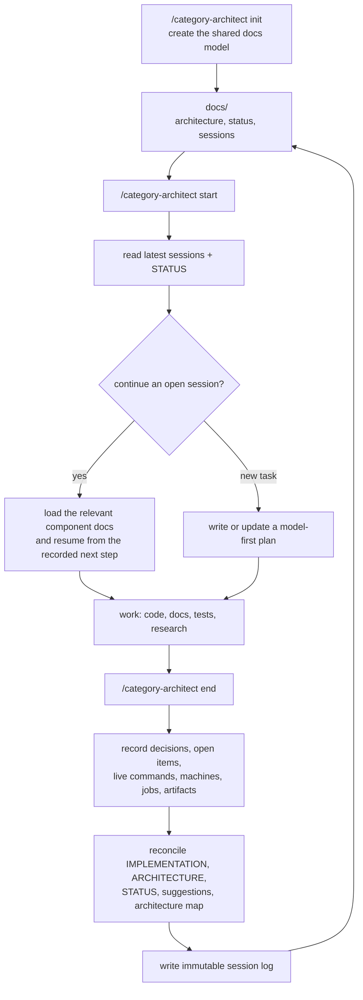
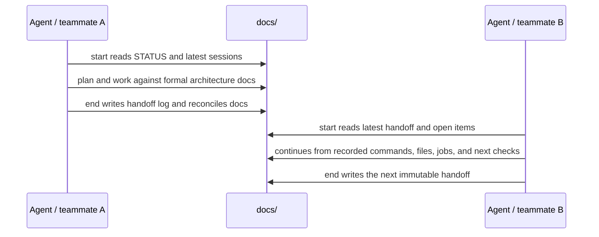
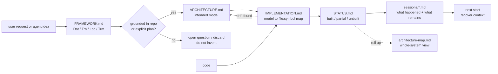

# category-architect

A Claude Code / Codex / Kimi **team workflow skill** for making work survive from one
session to the next.

The normal rhythm is simple:

```text
/category-architect init    # once per repo
/category-architect start   # first command of every session
/category-architect end     # last command of every session
```

`start` rebuilds context from shared docs and recent session logs. `end` records
what changed, what is still open, how to resume it, and any live external state
such as running commands, machines, jobs, ports, or generated data. A teammate can
open a fresh agent, run `start`, choose the continuation, and keep working without
reconstructing the previous session from chat history.

The architecture side is formal on purpose. The bundled `FRAMEWORK.md` is the
root method: it models the project as data (`Dat`), transformations (`Trn`),
locations (`Loc`), and transmissions (`Trm`). Every proposed component, feature,
boundary, and field has to land in that model and then map to real code via
`file:symbol`. If it cannot be grounded that way, it is not accepted as fact - it
becomes an open question, a planned item, or is discarded.

That is the point of using category theory here: it keeps the AI from drifting
into imagined architecture. The agent is forced to ask "what object is this?",
"what morphism changes it?", "where does it run?", "what carries it across a
boundary?", and "which real code realizes it?" The result is a formalized,
grounded way to engineer the system, not just prettier documentation.

How the formal basis works in practice:

1. **Name the real objects.** Data, states, files, API payloads, queues, and
   persisted records become `Dat`.
2. **Name the real arrows.** Functions, jobs, transitions, validators, renders,
   imports, and exports become `Trn`/morphisms.
3. **Name the real placement.** Processes, browsers, servers, workers, databases,
   and queues become `Loc`; cross-boundary carriers become `Trm`.
4. **Map model to code.** Every object and morphism gets a `file:symbol` in
   `IMPLEMENTATION.md`, or is marked planned/open.
5. **Check laws before accepting structure.** Coherence failures become bugs,
   explicit exceptions, or open work - not hand-waved prose.

The skill creates and maintains a `docs/` knowledge base:

- `docs/architecture-map.md` — a high-level whole-system map (four atoms,
  components, coherence checklist) that links down to detail;
- `docs/<component>/` — per component: `ARCHITECTURE.md` (the categorical model),
  `IMPLEMENTATION.md` (model → code map), `STATUS.md`, `suggestions.md`, plus
  `plans/`, `reviews/`, `general/`;
- `docs/IMPLEMENTATION.md`, `docs/STATUS.md`, `docs/suggestions.md` — deduced
  whole-system roll-ups;
- `docs/sessions/` — immutable per-session logs with decisions, open items, and
  continuation state any agent can resume from.

...and the workflow to keep all of it reconciled with the code across sessions and
across many agents.

## Team flow







---

## Install

### From GitHub

```bash
git clone https://github.com/<owner>/category-architect.git
cd category-architect
./install.sh
```

Replace `<owner>` with the GitHub user or org that publishes this repo.
Re-running `./install.sh` updates the installed skill in place.

For a project-only install:

```bash
./install.sh --project
```

One-command install from GitHub after the repo is published:

```bash
tmp=$(mktemp -d) && git clone https://github.com/<owner>/category-architect.git "$tmp/category-architect" && "$tmp/category-architect/install.sh"
```

### From a downloaded folder

From inside the unpacked `category-architect/` folder:

```bash
./install.sh            # installs into detected ~/.claude/skills, ~/.codex/skills,
                        # ~/.config/opencode/skills, ~/.kimi-code/skills (Kimi Code CLI,
                        # or ~/.agents/skills), and/or the Kimi Work desktop skills dir
./install.sh --project  # installs into detected ./.claude/skills, ./.codex/skills,
                        # ./.opencode/skills, and/or ./.kimi-code/skills (or ./.agents/skills)
```

Kimi Work (the desktop app) keeps skills in a single user-level directory, so it is
installed even with `--project`. If it lives somewhere other than
`~/Library/Application Support/kimi-desktop/daimon-share/daimon`, point the
installer at it with `KIMI_WORK_HOME=/path/to/daimon ./install.sh`.

### Copy by hand

```bash
# personal (all projects)
cp -R category-architect ~/.claude/skills/
cp -R category-architect ~/.codex/skills/
cp -R category-architect ~/.kimi-code/skills/   # Kimi Code CLI (or ~/.agents/skills/)
cp -R category-architect "$HOME/Library/Application Support/kimi-desktop/daimon-share/daimon/skills/"  # Kimi Work

# or project-scoped (this repo only)
mkdir -p .claude/skills && cp -R category-architect .claude/skills/
mkdir -p .codex/skills && cp -R category-architect .codex/skills/
mkdir -p .kimi-code/skills && cp -R category-architect .kimi-code/skills/
```

That's it — no dependencies. Claude Code, Codex, Kimi Code, and Kimi Work all
auto-discover skills in their `skills/` directories. Kimi Code scans
`$KIMI_CODE_HOME/skills/` (default `~/.kimi-code/skills/`) and `~/.agents/skills/`
at user level, and `.kimi-code/skills/` or `.agents/skills/` at project level.
Restart the session (or start a new one) and the skill is live. In Kimi
Code you can also invoke it explicitly with `/skill:category-architect`.

---

## Use

```
/category-architect init      # run once: bootstrap docs from the existing code
/category-architect start     # run first: recover the latest team/session state
/category-architect end       # run last: reconcile docs and write the handoff log
/category-architect suggest   # derive an improvement backlog from the formal model
```

The important habit is `start` then `end`. In between, describe the work normally:
"continue the payment refactor", "plan feature X", "fix the failing import job",
"reconcile the docs with the code". The skill routes the work through the shared
model and leaves the next session a usable handoff.

`FRAMEWORK.md` is bundled and is the base of everything. The agent reads it first
each session. Every generated doc cites the framework section it applies.

## Examples

Start a new day:

```text
/category-architect start
continue the import pipeline work
```

The skill reads the latest session logs, shows the relevant open items, checks the
recorded branch/jobs/artifacts if needed, then resumes from the stored next step.

End a session with unfinished work:

```text
/category-architect end
```

The skill records what is done, what remains, exact next commands, affected docs,
test results, and any live state such as a dev server, cloud machine, queue job,
port, generated file, or dataset. The next teammate starts from that log.

Avoid architecture drift:

```text
plan the billing retry change
```

The skill writes or updates a model-first plan, maps the change to real
`file:symbol`s, runs the coherence checks, and reconciles the docs at `end`.

---

## What's in this folder

```
category-architect/
├── SKILL.md                    # the skill: overview, doc tree, modes, disciplines
├── FRAMEWORK.md                # the method (category theory) — base of everything
├── README.md                   # this file
├── install.sh                  # copies the skill into place
└── references/
    ├── init.md                 # bootstrap procedure
    ├── authoring.md            # how to write each doc type, with templates
    ├── sessions.md             # start protocol + session logs + reconciliation
    ├── build.md                # plan → implement → test → fix → reconcile
    └── status-suggestions.md   # STATUS reconciliation + CT-derived suggestions
```

Portable and self-contained - hand the folder, zip, or GitHub repo to anyone.
