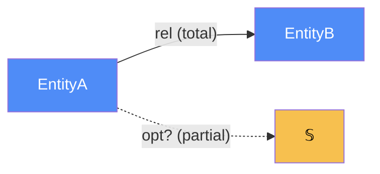

# authoring — how to write each doc type from FRAMEWORK.md

Every document here is written from `FRAMEWORK.md`. Read it before authoring. This
file gives the **section order** and a **copy-paste template** for each doc type.
The rules that are not repeated here (naming, partiality markers, the Mermaid color
legend) live in the FRAMEWORK appendix — follow them so all diagrams read the same.

Universal rules (from §2 and §8):
- **Model-first.** The categorical model is the first section after the overview.
- **Diagram ⇔ table.** Every arrow in a diagram appears in a morphism table, and
  every table row appears in a diagram. No orphans either way.
- **Always write signatures** `f : A → B`; source and target are half the content.
- **Partiality is explicit** — `Total` / `Partial` / `Deduced` / `Future`; dashed
  or `?`-suffixed edges for partial/deduced (§ appendix).
- **State the store-vs-deduce choice** for anything computable from other data.

Color legend (use verbatim, FRAMEWORK appendix): blue `#4f8cf7` data/authoritative
`DataLoc`; green `#7fc47f` `Trn`; red `#f77f7f` `Loc`/owning party; teal `#7fc4c4`
`Trm`/junction; yellow `#f7c04f` primitives/placement objects/ports; purple
`#cf7fcf` components/enums; grey `#9a9a9a` deduced/future/non-authoritative.

---

## `<component>/ARCHITECTURE.md`

The intended specification of one component, model-first. Sits in the component
folder; the whole-system map links to it. Follow FRAMEWORK **§2's seven-part order**
(the "How to write a model section"), then add the **§4** atoms the component owns.

Section order:

1. **Overview** (≤1 short paragraph) — what this component *is*, one line of scope.
2. **Why** (§2.1) — what modeling *this* categorically buys, concretely
   (e.g. "nullability encodes the guest-vs-member case", "`total` deduces as
   `sum ∘ lines`").
3. **Core category** (§2.2) — a Mermaid diagram: objects + labeled morphism arrows;
   `?`/dashed for partial/deduced.
4. **Morphism table** (§2.3) — every arrow, with `Signature`, `Partiality`,
   `Semantics`.
5. **Functors** (§2.4) — one diagram+table per functor to another category
   (a pipeline, a state machine, a strategy resolver, a renderer).
6. **Composition rules** (§2.5) — numbered invariants/deductions/constraints the
   implementation must preserve.
7. **The four atoms it owns** (§4.1) — short tables: its `Trn` (`t_from → t_to`,
   effectful `⊸`), the `Loc`(s) it runs at (or "collapsed — one process"), any real
   `Trm` (`carries`, `c_from → c_to`), and **placements** (§4.2) where a `Trn`/`Dat`
   runs/materialises in more than one place.
8. **Bridges to other components** (§2.6) — a table of boundary morphisms/ports,
   each with a `Stored?` column making the store-vs-deduce tradeoff explicit.
9. **Coherence notes** — any of the §4.5 laws that bite *inside* this component, and
   how it satisfies them (the whole-system checklist lives in the map).

Template:

```markdown
# <Component> — categorical model

> Model-first (FRAMEWORK §2/§4). Intended specification for this component; the
> code realises it (see IMPLEMENTATION.md). Source of record: <files>.

## 1. Overview
<one paragraph: what it is, its scope>

## 2. Why
<one paragraph: what modeling this as a category buys HERE — concretely>

## 3. Core category


## 4. Morphism table
| Morphism | Signature | Partiality | Semantics |
| --- | --- | --- | --- |
| `rel` | `EntityA → EntityB` | Total | ... |
| `opt?` | `EntityA → 𝕊` | Partial | ..., present only when ... |
| `derived` | `EntityA → ℝ` | Deduced | `derived = f ∘ g` — not stored |

## 5. Functors
<diagram + table per functor: pipeline / status state machine / strategy resolver>

## 6. Composition rules
1. `invariant: total = subtotal + tax`
2. `deduction: resolve = match ∘ vendor`
3. `constraint: <uniqueness / naturality law>`

## 7. Atoms owned (FRAMEWORK §4)
**Trn** — | `Trn` | `t_from → t_to` | Realising code |
**Loc** — <the site(s); or "collapsed to one process — Dat+Alg (§7.1)">
**Trm** — <real cross-Loc transmissions, or "none — all handoffs same-Loc → Trn">
**Placements (§4.2)** — <Trn/Dat placed more than once: the runsAt-is-a-relation rows>

## 8. Bridges to other components (ports)
| Boundary morphism | Signature | Stored? | Semantics |
| --- | --- | --- | --- |
| `port_x` | `This → Other` | Deduced | ... |

## 9. Coherence notes
<which §4.5 laws bite here and how this component satisfies them>
```

**Sizing.** A tiny component (a pure helper package, §7.1 degenerate case) needs
only Overview, Why, Core category, Morphism table, and the `Trn` table — omit
functors/atoms that do not exist. Do not pad. A component that straddles the wire
(a service, §7.2) must fill `Loc`, `Trm`, and placements fully.

---

## `<component>/IMPLEMENTATION.md`

The **functor from the model to the code** (FRAMEWORK's "Realising code" column,
promoted to its own doc). One table maps every object and morphism named in
ARCHITECTURE.md to the concrete `file:symbol` that realises it. This is where the
model touches the repository; a row with no `file:symbol` is either unbuilt
(→ STATUS) or a modeling error (→ fix the model).

```markdown
# <Component> — implementation map

> The functor ARCHITECTURE.md → code. Each categorical object/morphism → the
> file:symbol that realises it. Keep in sync WITH the code (FRAMEWORK §6.3):
> a new morphism gets a row here in the same change that adds its code.

## Objects (Dat) → code
| Object | Form / shape | Realised at | State |
| --- | --- | --- | --- |
| `EntityA` | `{ id, ... }` | `models/a.py:EntityA` | built |
| `EntityB` | ... | `models/b.py:EntityB` | built |

## Morphisms (Trn / relations) → code
| Morphism | Signature | Realising code | State |
| --- | --- | --- | --- |
| `rel` | `EntityA → EntityB` | `a.py:EntityA.b` (FK) | built |
| `derived` | `EntityA → ℝ` | `service.py:compute_derived` | built |
| `port_x` | `This → Other` | `adapters/x.py:XAdapter.call` | partial |

## Composition rules → where enforced
| Rule (from ARCHITECTURE §6) | Enforced at | Tested at |
| --- | --- | --- |
| `total = subtotal + tax` | `order.py:Order.total` | `test_order.py::test_total_invariant` |

## Notes / divergences
<where code and model differ, and the resolution per §6.6 (fix code OR Note: exception)>
```

The **State** column values: `built` / `partial` / `planned`. STATUS.md aggregates
these; keep them truthful — this table is the ground truth STATUS deduces from.

---

## `docs/IMPLEMENTATION.md`

The **whole-system functor**: `architecture-map.md` → code. **Deduced** from the
component IMPLEMENTATIONs (§4.3) — do not re-list every morphism here (that lives in
the component files); carry only the system-level rows: each component → its code
root + doc link, and the **shared/cross-component** objects and ports that no single
component owns alone. Drift between two components claiming the same `Dat` shows up
here first.

```markdown
# System implementation map

> Whole-system functor architecture-map.md → code, deduced from the component
> IMPLEMENTATION.md files. System-level rows only; per-morphism detail lives in the
> linked component maps. Keep in sync WITH the code (FRAMEWORK §6.3).

## Components → code root
| Component | Code root | Model | Code map |
| --- | --- | --- | --- |
| Encoder | `src/encoder/` | [encoder/ARCHITECTURE.md](encoder/ARCHITECTURE.md) | [encoder/IMPLEMENTATION.md](encoder/IMPLEMENTATION.md) |
| Billing | `src/billing/` | ... | [billing/IMPLEMENTATION.md](billing/IMPLEMENTATION.md) |

## Shared objects (one Dat, DataLocs in ≥2 components)
| Object | Authoritative at | Also read by | Realised at |
| --- | --- | --- | --- |
| `User` | `auth/models.py:User` | Billing, Search | (tied — one source of truth) |

## Inter-component transmissions / ports (Trm)
| Port | carries | c_from → c_to | Realising code |
| --- | --- | --- | --- |
| `pay_event` | `PaymentMade` | Billing → Ledger | `bus/pay.py:emit` / `ledger/sub.py:on_pay` |

## System entry points
| Entry | Trn triggered | Code |
| --- | --- | --- |
| HTTP `POST /order` | `create_order` | `api/orders.py:create` |

## Divergences (system-level)
<cross-component drift: same Dat named/shaped differently across components, per §6.6>
```

---

## `docs/architecture-map.md`

The whole-system map, from FRAMEWORK **§4**, **high-level with drill-down pointers**.
Its job is to lay foundations and route to detail, not to hold detail. Model the
example on `docs/architecture-map.md` in a mature tree — but *less banter*: keep the
foundation and the pointers, drop the prose padding.

```markdown
# Whole-system categorical map (Dat/Trn/Loc/Trm)

> Top-level architecture doc (FRAMEWORK §4). Names the four atoms, lists components
> (each linking to its ARCHITECTURE.md), reifies placement where it's a relation,
> and runs the §4.5 coherence checklist against the code. High-level — detail lives
> in the linked component docs. Source of record: <entry points, config, types>.

## 1. Why (one paragraph)
<what modeling the whole system categorically buys — e.g. "wrong gets a location">

## 2. The four atoms (at a glance)
**Dat** — <table: key data types, shape, where they live>
**Trn** — <table: key transformations, t_from→t_to, owning component>
**Loc** — <the sites; state plainly if Loc collapses to one process (§7.1)>
**Trm** — <the real cross-Loc transmissions; "none at this scale" is a valid answer>

## 3. Components
| Component | Owned `Trn` | Built/active when | Doc |
| --- | --- | --- | --- |
| `Encoder` | encode, ... | always | [encoder/ARCHITECTURE.md](encoder/ARCHITECTURE.md) |
| ... | ... | flag/condition | [.../ARCHITECTURE.md](...) |

## 4. Placement (only where runsAt is a relation, §4.2)
| `Trn`/`Dat` | placements | why it matters |
| --- | --- | --- |
| ... | placed at input AND inside round-trip | one Trn, many call sites |

## 5. Coherence checklist (§4.5 / §8) against the implementation
- [x] 1. Placement honesty — <one line>
- [x] 2. Transmission well-typing — <one line>
- [x] 3. Placement totality — <one line>
- [x] 4. Dependency mediation — <one line>
- [x] 5. Composition soundness — <one line>
- [x] 6. runsAt is a relation — <one line>

## 6. Modeling smells swept (§3)
<one line: no parallel objects / deduced-not-copied / one source of truth per shared Dat>
```

Use `[x]` PASS, `[ ]` FAIL (with the localised defect named), `[~]` partial/advisory.
A FAIL here is a real architecture bug — surface it, don't paper over it.

---

## `<component>/STATUS.md` and `docs/STATUS.md`

See [`status-suggestions.md`](status-suggestions.md) — STATUS is a *reconciliation*
artifact (model vs code), not a fresh authoring task, so it lives with the
reconciliation playbook.

## `<component>/suggestions.md` and `docs/suggestions.md`

See [`status-suggestions.md`](status-suggestions.md) — suggestions are *derived*
from the model by CT rules, so they live with that playbook too.

## `sessions/YYYY-MM-DD-<slug>.md`

See [`sessions.md`](sessions.md).
