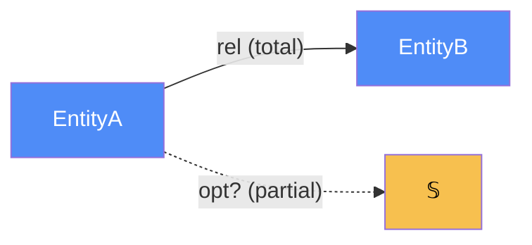

# docs-tree — the `docs/` contract, and how to write each doc

`docs/` is the **intent layer**. It is hand-authored, normative, and small. It is
never generated wholesale, and nothing else writes into it.

```
docs/
├── architecture-map.md      # whole-system §4 map: four atoms, components, coherence
│                            #   checklist. HIGH-LEVEL — foundations + pointers, no banter.
├── IMPLEMENTATION.md        # roll-up functor: architecture-map.md → code roots + shared
│                            #   objects/ports → file:symbol; links to component maps.
├── STATUS.md                # roll-up of every <component>/STATUS.md, one row per component
├── suggestions.md           # roll-up of every <component>/suggestions.md, CT-derived
├── sessions/
│   └── YYYY-MM-DD-<slug>.md  # immutable handoff logs — see sessions.md
└── <component>/
    ├── ARCHITECTURE.md       # the categorical model of this component (§2 + §4)
    ├── IMPLEMENTATION.md     # functor: each object/morphism → real file:symbol
    ├── STATUS.md             # docs-vs-code reconciliation for THIS component
    ├── suggestions.md        # CT-derived improvement proposals for THIS component
    ├── reviews/
    │   └── review-<slug>.md   # §4.5 checklist run AFTER building — see reconcile.md
    └── general/              # notes, investigations, benchmarks, decision records
```

**There is no `plans/` folder.** In-flight work lives in `openspec/changes/<slug>/`
and is deleted at archive. If an adopting repo already has `docs/*/plans/*.md`,
**leave them in place** — do not migrate history. New work only.

**Naming.** A "component" is a `Cmp` (§4.3): a cohesive bundle of placements — a
feature, a service, a subsystem, a package. Use the codebase's own vocabulary
(`auth/`, `billing/`, `encoder/`). Keep it flat: one level of component folders. A
component big enough to have sub-components gets sub-folders *inside* its own
folder, each a smaller copy of this layout.

---

## Scaffolding a tree that does not exist yet

Read `FRAMEWORK.md` first. Order is deliberate: understand → decompose → model each
→ deduce the roll-ups. Never write a roll-up before the things it rolls up exist.

1. **Build the graph.** `graphify .` If one already exists, use it. It gives you
   file relationships and **community detection** — the communities are your first
   draft of the component decomposition, derived rather than invented. Query it for
   the seams: entry points, boundaries, what talks to what.
   *No graphify?* Fall back to parallel read-only agents, one per top-level
   directory, each returning that slice's `Dat`, `Trn`, `Loc`/`Trm`, and ports.
2. **Decompose into components** using the code's own seams — packages, services,
   bounded contexts — not an invented taxonomy. Apply the **§3 Consolidation
   Principle now, before writing anything**: two candidates that are "the same
   objects, different morphisms" are one component. Merge them. Fold in prior art
   (`README`, ADRs, design notes) rather than discarding it.
3. **Write `architecture-map.md`** — high-level, per the template below.
4. **Populate each component folder** — `ARCHITECTURE.md`, `IMPLEMENTATION.md`,
   `STATUS.md`, plus empty `reviews/` and `general/`. One agent per component works
   well; follow it with a consistency pass, because the same `Dat` must be named
   identically across components — it is one object with several `DataLoc`s, not
   twins.
5. **Deduce the roll-ups** — `docs/IMPLEMENTATION.md`, `docs/STATUS.md`, then
   back-fill the map's component table and coherence checklist.
6. **Generate suggestions**, then write `sessions/YYYY-MM-DD-init.md` recording the
   decomposition chosen and any components merged under §3, so the next agent
   inherits the reasoning.
7. **Run the drift check.** On a real repo the first run finds things; that is the
   point. Fix or record before calling the tree done.

**Greenfield variant (no code yet).** Same steps, but step 1 reads the *intent* — a
brief, a spec, the user's description. `IMPLEMENTATION.md` rows are all `planned`;
STATUS is all unbuilt. The value is that the model exists *before* the code (§6.1).

---

## Universal authoring rules (§2, §8)

- **Model-first.** The categorical model is the first section after the overview.
- **Diagram ⇔ table.** Every arrow in a diagram appears in a morphism table, and
  every table row appears in a diagram. No orphans either way.
- **Always write signatures** `f : A → B`; source and target are half the content.
- **Partiality is explicit** — `Total` / `Partial` / `Deduced` / `Future`; dashed or
  `?`-suffixed edges for partial and deduced.
- **State the store-vs-deduce choice** for anything computable from other data.

Color legend (verbatim, FRAMEWORK appendix): blue `#4f8cf7` data / authoritative
`DataLoc`; green `#7fc47f` `Trn`; red `#f77f7f` `Loc` / owning party; teal `#7fc4c4`
`Trm` / junction; yellow `#f7c04f` primitives, placement objects, ports; purple
`#cf7fcf` components and enums; grey `#9a9a9a` deduced, future, non-authoritative.

---

## `<component>/ARCHITECTURE.md`

The intended specification of one component, model-first. FRAMEWORK **§2's
seven-part order**, then the **§4** atoms the component owns.

~~~markdown
# <Component> — categorical model

> Model-first (FRAMEWORK §2/§4). Intended specification for this component; the
> code realises it (see IMPLEMENTATION.md). Source of record: <files>.

## 1. Overview
<one paragraph: what it is, its scope>

## 2. Why
<one paragraph: what modeling this as a category buys HERE — concretely>

## 3. Core category


## 4. Morphism table
| Morphism | Signature | Partiality | Semantics |
| --- | --- | --- | --- |
| `rel` | `EntityA → EntityB` | Total | ... |
| `opt?` | `EntityA → 𝕊` | Partial | present only when ... |
| `derived` | `EntityA → ℝ` | Deduced | `derived = f ∘ g` — not stored |

## 5. Functors
<diagram + table per functor: pipeline / status state machine / strategy resolver>

## 6. Composition rules
1. `invariant: total = subtotal + tax`
2. `deduction: resolve = match ∘ vendor`
3. `constraint: <uniqueness / naturality law>`

## 7. Atoms owned (FRAMEWORK §4)
**Trn** — | `Trn` | `t_from → t_to` | Realising code |
**Loc** — <the site(s); or "collapsed to one process — Dat+Alg (§7.1)">
**Trm** — <real cross-Loc transmissions, or "none — all handoffs same-Loc → Trn">
**Placements (§4.2)** — <Trn/Dat placed more than once: the runsAt-is-a-relation rows>

## 8. Bridges to other components (ports)
| Boundary morphism | Signature | Stored? | Semantics |
| --- | --- | --- | --- |
| `port_x` | `This → Other` | Deduced | ... |

## 9. Coherence notes
<which §4.5 laws bite here and how this component satisfies them>
~~~

**Sizing.** A tiny component (a pure helper package, §7.1 degenerate case) needs
only Overview, Why, Core category, Morphism table and the `Trn` table — omit what
does not exist, do not pad. A component that straddles the wire (§7.2) must fill
`Loc`, `Trm` and placements fully.

---

## `<component>/IMPLEMENTATION.md`

The **functor from model to code**. Every object and morphism named in
ARCHITECTURE.md → the `file:symbol` that realises it. This is where the model meets
the repository, so it is where drift shows first — and it is the only doc the drift
check reads. A row with no `file:symbol` is either unbuilt (→ STATUS) or a modeling
error (→ fix the model).

~~~markdown
# <Component> — implementation map

> The functor ARCHITECTURE.md → code. Each object/morphism → the file:symbol that
> realises it. Keep in sync WITH the code (§6.3): a new morphism gets a row here in
> the same change that adds its code.

## Objects (Dat) → code
| Object | Form / shape | Realised at | State |
| --- | --- | --- | --- |
| `EntityA` | `{ id, ... }` | `src/models/a.py:EntityA` | built |

## Morphisms (Trn / relations) → code
| Morphism | Signature | Realising code | State |
| --- | --- | --- | --- |
| `rel` | `EntityA → EntityB` | `src/models/a.py:EntityA::b` | built |
| `port_x` | `This → Other` | `src/adapters/x.py:XAdapter::call` | partial |

## Composition rules → where enforced
| Rule (ARCHITECTURE §6) | Enforced at | Tested at |
| --- | --- | --- |
| `total = subtotal + tax` | `src/order.py:Order::total` | `tests/test_order.py:test_total_invariant` |

## Notes / divergences
<where code and model differ, and the resolution per §6.6>
~~~

`State` is `built` / `partial` / `planned`; STATUS aggregates it, so keep it
truthful. **Write refs the drift check can resolve**: backticked
`` `path/to/file.ext:Symbol` `` or `` `path/to/file.ext:Class::method` ``, with at
least one directory in the path. Repo-relative or service-relative both work — paths
are matched by suffix against `git ls-files`.

---

## `docs/IMPLEMENTATION.md`

The **whole-system functor**, deduced from the component maps (§4.3). Do not
re-list every morphism — carry only system-level rows: each component → its code
root, plus the shared objects and ports no single component owns alone. Two
components claiming the same `Dat` shows up here first.

~~~markdown
# System implementation map

> Whole-system functor architecture-map.md → code, deduced from the component
> IMPLEMENTATION.md files. System-level rows only.

## Components → code root
| Component | Code root | Model | Code map |
| --- | --- | --- | --- |
| Encoder | `src/encoder/` | [encoder/ARCHITECTURE.md](encoder/ARCHITECTURE.md) | [encoder/IMPLEMENTATION.md](encoder/IMPLEMENTATION.md) |

## Shared objects (one Dat, DataLocs in ≥2 components)
| Object | Authoritative at | Also read by | Realised at |
| --- | --- | --- | --- |
| `User` | `src/auth/models.py:User` | Billing, Search | (tied — one source of truth) |

## Inter-component transmissions / ports (Trm)
| Port | carries | c_from → c_to | Realising code |
| --- | --- | --- | --- |
| `pay_event` | `PaymentMade` | Billing → Ledger | `src/bus/pay.py:emit` |

## System entry points
| Entry | Trn triggered | Code |
| --- | --- | --- |
| HTTP `POST /order` | `create_order` | `src/api/orders.py:create` |

## Divergences (system-level)
<cross-component drift: the same Dat named or shaped differently, per §6.6>
~~~

---

## `docs/architecture-map.md`

The whole-system map from FRAMEWORK **§4**: **high-level, with drill-down
pointers**. Lay foundations and route to detail; do not hold detail.

~~~markdown
# Whole-system categorical map (Dat/Trn/Loc/Trm)

> Top-level architecture doc (§4). Names the four atoms, lists components (each
> linking to its ARCHITECTURE.md), reifies placement where it is a relation, and
> runs the §4.5 coherence checklist against the code. Detail lives in the linked
> component docs. Source of record: <entry points, config, types>.

## 1. Why
<one paragraph: what modeling the whole system categorically buys here>

## 2. The four atoms (at a glance)
**Dat** — <table: key data types, shape, where they live>
**Trn** — <table: key transformations, t_from→t_to, owning component>
**Loc** — <the sites; say plainly if Loc collapses to one process (§7.1)>
**Trm** — <the real cross-Loc transmissions; "none at this scale" is a valid answer>

## 3. Components
| Component | Owned `Trn` | Built/active when | Doc |
| --- | --- | --- | --- |
| `Encoder` | encode, ... | always | [encoder/ARCHITECTURE.md](encoder/ARCHITECTURE.md) |

## 4. Placement (only where runsAt is a relation, §4.2)
| `Trn`/`Dat` | placements | why it matters |
| --- | --- | --- |

## 5. Coherence checklist (§4.5 / §8) against the implementation
- [x] 1. Placement honesty — <one line>
- [x] 2. Transmission well-typing — <one line>
- [x] 3. Placement totality — <one line>
- [x] 4. Dependency mediation — <one line>
- [x] 5. Composition soundness — <one line>
- [x] 6. runsAt is a relation — <one line>

## 6. Modeling smells swept (§3)
<no parallel objects · deduced not copied · one source of truth per shared Dat>
~~~

`[x]` PASS, `[ ]` FAIL with the localised defect named, `[~]` partial/advisory. A
FAIL here is a real architecture bug — surface it.

---

## STATUS — model vs code, reconciled

Derived, not authored. The `State` column in IMPLEMENTATION.md is ground truth;
STATUS aggregates it and adds judgement about what still needs work.

~~~markdown
# <Component> — status

> Reconciles ARCHITECTURE.md (intent) vs IMPLEMENTATION.md (code). Updated whenever
> code changes what is done (§6.5).

## Headline
<one line: built / partial / unbuilt, and the single most important gap>

## Completeness
| Object / morphism | State | Notes |
| --- | --- | --- |
| `rel` | ✅ built | |
| `port_x` | 🟡 partial | adapter stubbed, no retry |
| `newthing` | ⬜ unbuilt | in flight: `openspec/changes/<slug>/` |

## Needs work
1. <the concrete next thing, with why>

## Coherence
<any §4.5 law currently FAILing or advisory-only for this component>

## Where to dig
- Model: ARCHITECTURE.md · Code map: IMPLEMENTATION.md
- In flight: `openspec/changes/<slug>/` · Reviews: reviews/ · Notes: general/
~~~

`docs/STATUS.md` is the roll-up — one row per component, deduced from the parts, so
`end` can rebuild it mechanically. Keep it scannable.

~~~markdown
# System status

> Roll-up of every <component>/STATUS.md. Detail lives in the linked file.

| Component | State | Headline gap | In flight | Detail |
| --- | --- | --- | --- | --- |
| Encoder | ✅ built | — | — | [encoder/STATUS.md](encoder/STATUS.md) |
| Billing | 🟡 partial | refunds unbuilt | `add-refunds` 4/9 | [billing/STATUS.md](billing/STATUS.md) |

## Cross-cutting
<system-wide open ends: coherence FAILs, atoms that de-collapse at scale>
~~~

Legend: ✅ built · 🟡 partial · ⬜ unbuilt. Derive the **In flight** column from
`openspec list --json` — never hand-maintain it.

---

## suggestions — improvements DERIVED from category theory

Not taste. Every suggestion cites the FRAMEWORK rule it applies and names the
concrete change. Lowest-priority surface in the tree — it rots fastest, so keep it
short and do not expand it. Hunt these specific, checkable smells:

- **Consolidation (§3).** Two objects that are "the same objects, different
  morphisms" → merge, make the extra morphisms partial plus a discriminator. A
  junction table that only marks a subset → a partial field. An adapter between
  shapes differing only in populated fields → delete it.
- **Deduce-don't-store (§5).** A stored value computable from others, with no
  consistency mechanism → deduce it, or justify the copy and name the mechanism.
- **Coherence-law fixes (§4.5).** Any law currently FAILing → the fix that restores
  it (a missing `DataLoc`/`Trm` for Laws 1/2, mediation for Law 4).
- **One source of truth (§5).** Two near-identical structures that can drift → push
  the difference to a single declared seam.
- **Ports & strategy (§5, §4.4).** A core transmission landing on a *concrete*
  external component → put a port between them.
- **Anchor on the durable entity (§3 corollary).** A link routed through a transient
  actor or session instead of the durable entity → re-anchor.
- **YAGNI (§5).** An abstraction modeled for a hypothetical future, an interface
  with one implementation → remove until the third call site appears.

~~~markdown
# <Component> — suggestions (category-theory derived)

> Deduced from ARCHITECTURE.md by FRAMEWORK rules. Each cites its rule and names the
> concrete change. Not applied — a backlog.

| # | Rule (§) | Smell found | Proposed change | Payoff |
| --- | --- | --- | --- | --- |
| 1 | §3 Consolidation | `Guest` and `Member` share all objects | merge into `User` + `kind?`, drop the translator | one vocabulary, no drift |
| 2 | §5 Deduce | `order.tax` stored, no reconcile job | deduce `tax = rate ∘ jurisdiction` | removes a drift source |

## Detail
### 1. <title>
<the reduction worked through per §3's five-step procedure, when it is a consolidation>
~~~

`docs/suggestions.md` rolls these up, highest payoff first, one line each, linking
to the detail — plus a **System-wide reductions** section for cross-component
consolidations, which is where the biggest wins live.

**Applying a suggestion is a normal `work` cycle** ([`reconcile.md`](reconcile.md)):
it becomes an OpenSpec change, gets built, tested and reconciled, and its row moves
out of suggestions into the session log.
